## Ejercio 2 - Portainer

##### Se descarga Portainer usando este comando :

```bash
victor@dockerej2:~$ docker run -d -p 9000:9000 -v /var/run/docker.sock:/var/run/docker.sock portainer/portainer
```
*Usamos las opciones -d, -p y -v en el comando docker run. La opción -d,  que corresponde a --detach, se utiliza para ejecutar el contenedor en  segundo plano. La opción -p, que representa --port, especifica el  puerto; en este caso, el '9000'. Por último, la opción -v, que significa --volumenes, se refiere a la ruta de montaje del volumen de Docker. En  este caso, es /var/run/docker.sock, que es el socket del host, y  /var/run/docker.sock, que es el socket del volumen.* 


Accedemos a Portainer desde `http://192.168.56.104:9000` en la maquina cliente. 


##### Muestra contenedores activos, para un contenedor, borra un contenedor:

*Voy a hacer pull de 2 contenedores aleatorios que voy a buscar en dockerhub para hacer la prueba.*

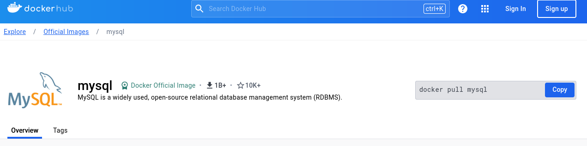

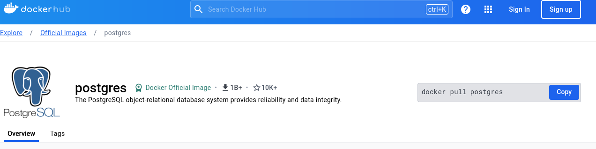

```bash
victor@dockerej2:~$ sudo docker pull mysql && sudo docker pull postgres
```

*Ahora que estan descargados los 2 contenedores, podemos hacer la prueba.*

```bash
 sudo docker run -d --name mi_postgres -e POSTGRES_PASSWORD=1234 -p 5432:5432 postgres &&  sudo docker run -d --name mi_mysql -e MYSQL_ROOT_PASSWORD=1234 -p 3306:3306 mysql
```

*El parametro `-e` se usa para establecer variables de entorno dentro del contenedor para ajustar configuraciones, en este caso la configuracion de la contraseña de las dos DB es crucial para que el contenedor funcione como es debido.*

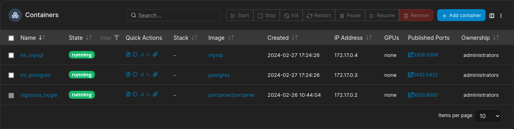

*Hay 3 contenedores, 1 de ellos es el propio `Portainer`.*

*Paramos `mysql`.*


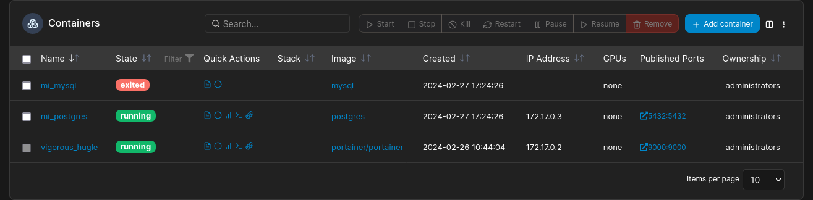


*Borramos `postgres`.*

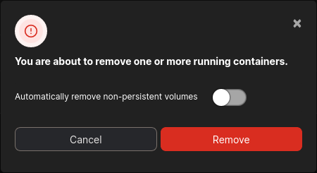


##### Muestra alguna operación con redes Docker:

*El unico contenedor con una conexion es el propio contenedor de `Portainer` que se llama `vigorous_hugle`.*

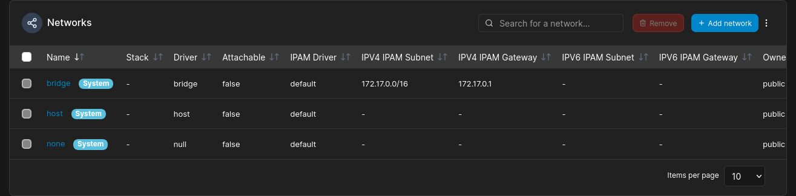

*Detalles de la conexion del contenedor.*

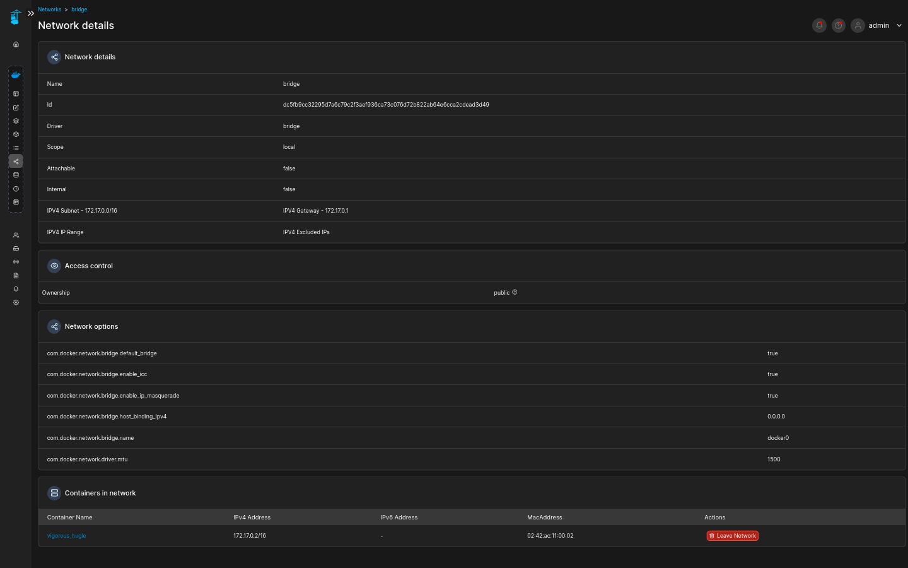

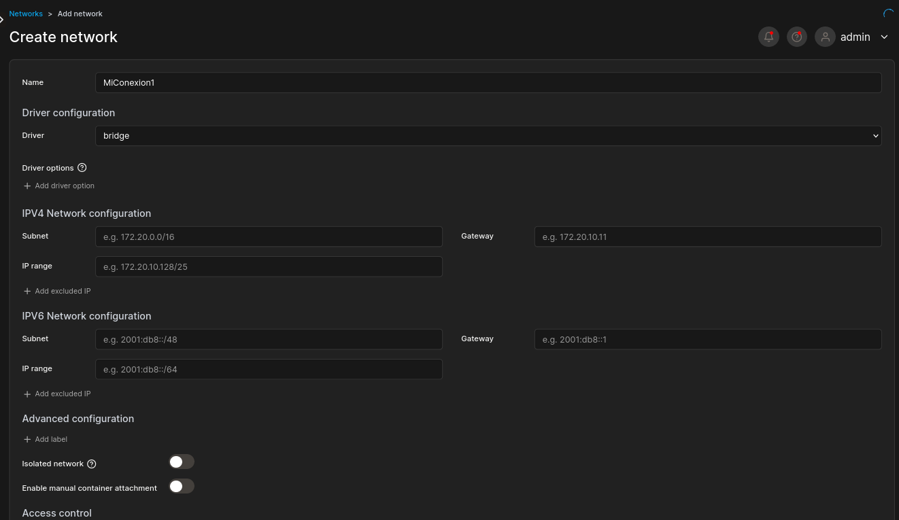

*Creamos una conexion nueva.*

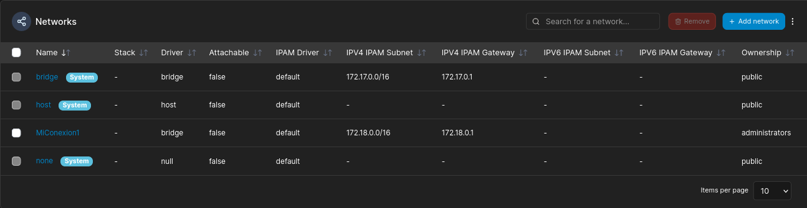


##### Muestra alguna operación con volúmenes Docker:

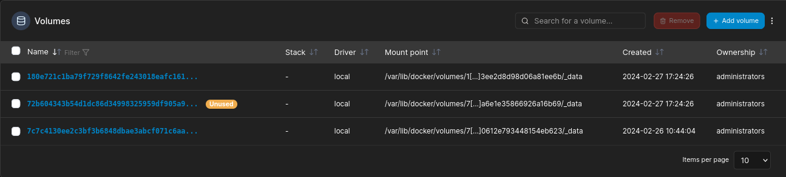

*Aqui se muestran los tres volumenes docker uno de ellos con el estado `unused` ya que eliminamos el contenedor de postgres en el primer ejercicio y el volumen esta pendiente de ser adjudicado.*

 *(tiene esos nombres porque no cree ningun volumen a mano con -v al hacer el docker run asi que los autogenera con nombres aleatorios).*

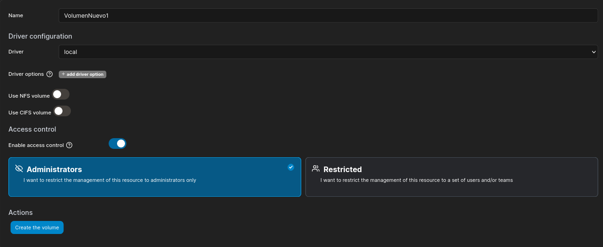

*Creo un volumen desde `Portainer`.*

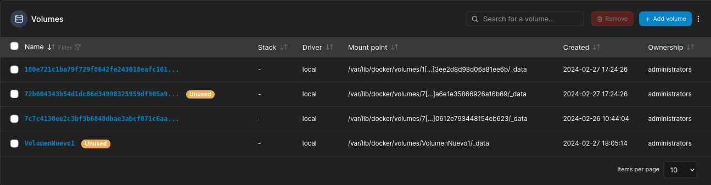

