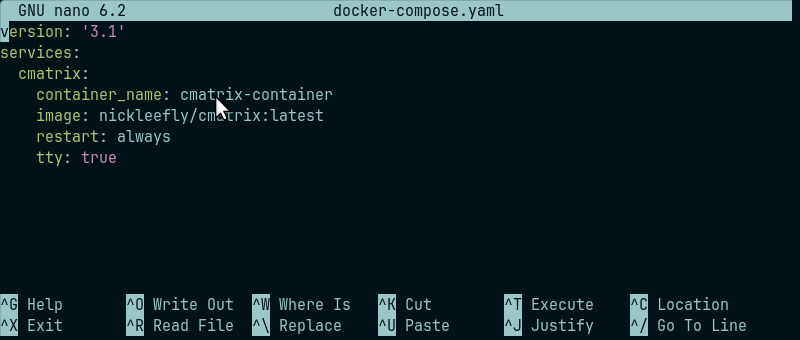
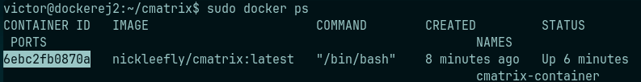

## Ejercicio 4 - Docker Compose

- ##### Captura de pantalla y documento donde se vea el fichero docker-compose.yaml:

  

  ```bash
  version: '3.1'
  services:
    cmatrix:
      container_name: cmatrix-container
      image: nickleefly/cmatrix:latest
      restart: always
      tty: true
  ```


- ##### Captura de pantalla y documento donde se vea la aplicación funcionando. Se valorará conseguir el efecto Greenrain:

  ```bash
  sudo docker-compose up -d # Para levantar el fichero con su configuracion
  sudo docker ps # Para ver el id del contenedor
  ```

​	*La sintaxis -d quiere decir que docker-compose  inicializara el fichero `.yaml` en --detached.*



```bash
sudo docker exec -it 6ebc2fb0870a cmatrix
```


*(Se mueve pero no puedo poner video en un archivo .md)*

- ##### Explicar brevemente cómo funciona esta aplicación:

  *Segun la info del repositorio de git.*

  **https://github.com/abishekvashok/cmatrix**

  > CMatrix esta basado en el salvapantallas de la pagina web de Matrix. 
  >
  > Muestra texto entrando y saliendo de la terminal como en la pelicula de Matrix.
  >
  > Puede desplazar lineas a un ritmo constante o asincronamente a una velocidad definida por el usuario.

